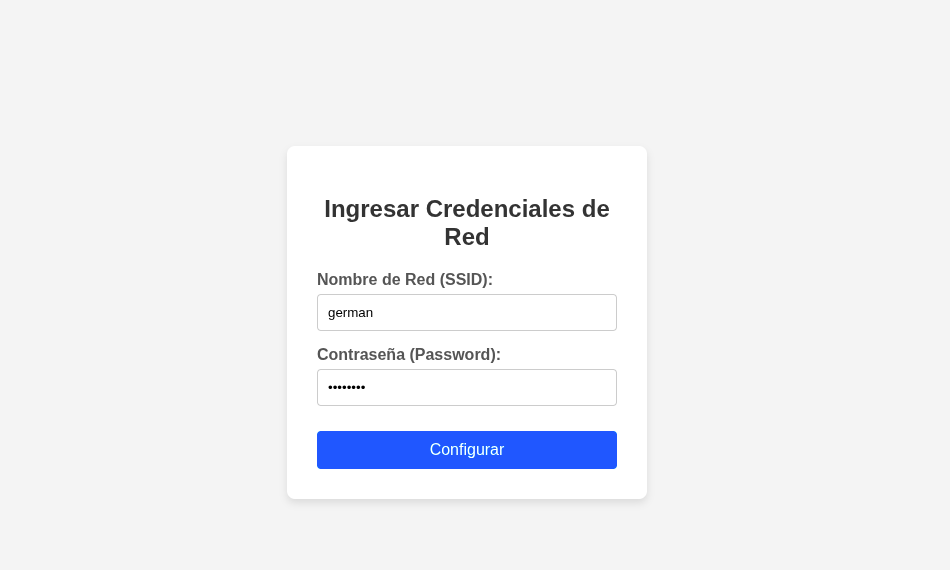
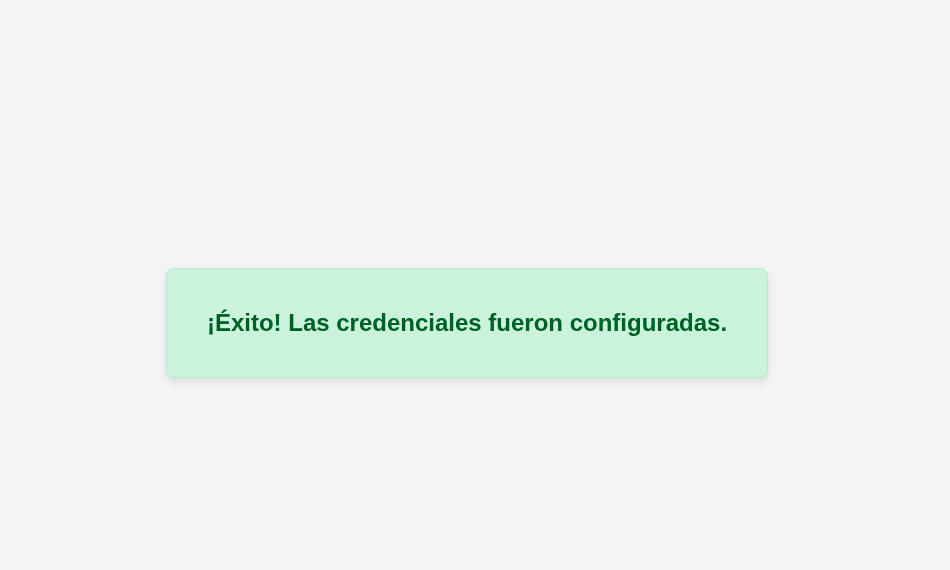
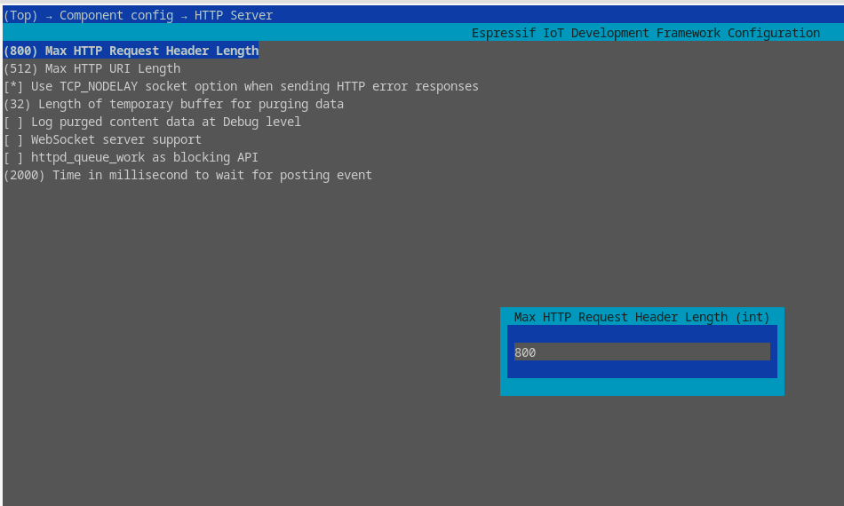

# WiFi Manager Web Component (ESP32)

Este proyecto implementa un **componente para ESP-IDF** que permite **gestionar credenciales WiFi (SSID y contraseña)** mediante una **interfaz web sencilla**.  
Está pensado para facilitar la configuración inicial de red en dispositivos ESP32 sin necesidad de recompilar el firmware.

---

## Descripción general

El componente crea un **punto de acceso (SoftAP)** y un **servidor web embebido**.  
Cuando el usuario se conecta al AP y accede a la página de configuración, puede ingresar su **SSID y contraseña WiFi** a través de un formulario web.

Una vez que el formulario es enviado, el componente:
1. Procesa la solicitud `POST` desde el servidor web.
2. Extrae las credenciales ingresadas.
3. Las guarda dinámicamente en memoria.
4. Notifica al programa principal que las credenciales están disponibles.

---

##  Interfaz Web

La interfaz consiste en una página HTML servida por el ESP32 (WMESP32) en la direccion 192.168.4.1, que presenta un formulario similar a:


```c

char *ssid = NULL;
char *password = NULL;

bool *ready = wm_start(&ssid, &password);

// Esperar hasta que el usuario envíe las credenciales
    while (!*ready) {
        vTaskDelay(100 / portTICK_PERIOD_MS);
    }

    // Ya hay datos válidos
    printf("SSID: %s\n", ssid);
    printf("PASS: %s\n", password);

    // El usuario debe liberar la memoria
    free(ssid);
    free(password);

 

```

### Interfaz Visual

<p align="center"></p>


<p align="center"></p>


### Nota importante

En caso de tener problemas con encabezados HTTP (HTTP headers) o con solicitudes que excedan el tamaño esperado,
es posible que debas aumentar el tamaño del buffer del servidor HTTP.
Esto puede hacerse desde el menú de configuración de ESP-IDF:
```bash
idf.py menuconfig
```

Ruta recomendada dentro del menú:

Component config  --->  HTTP Server  --->  Maximum HTTP Request Header Length

<p align="center"></p>


### Se agrego servidor dns. Por default es esp32-server.local

### Probemas Comunes:
- Si elegimos que la red WiFi del ESP32 tenga contraseña debe ser de tamaño 8 o superior.